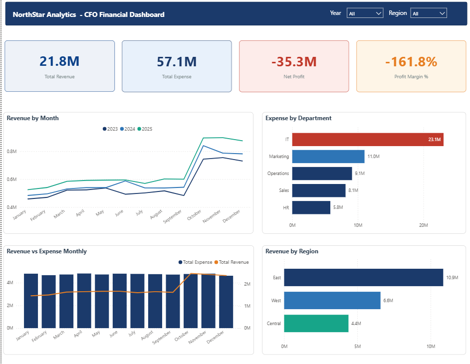
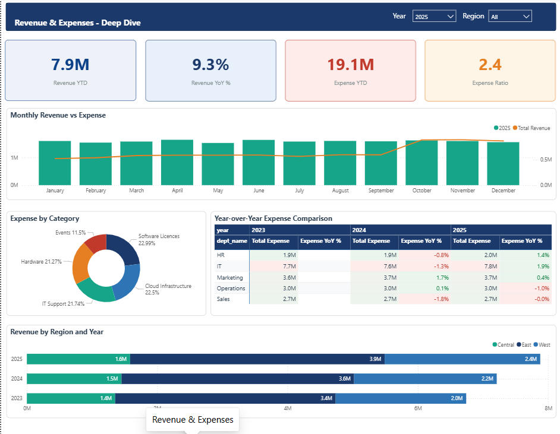
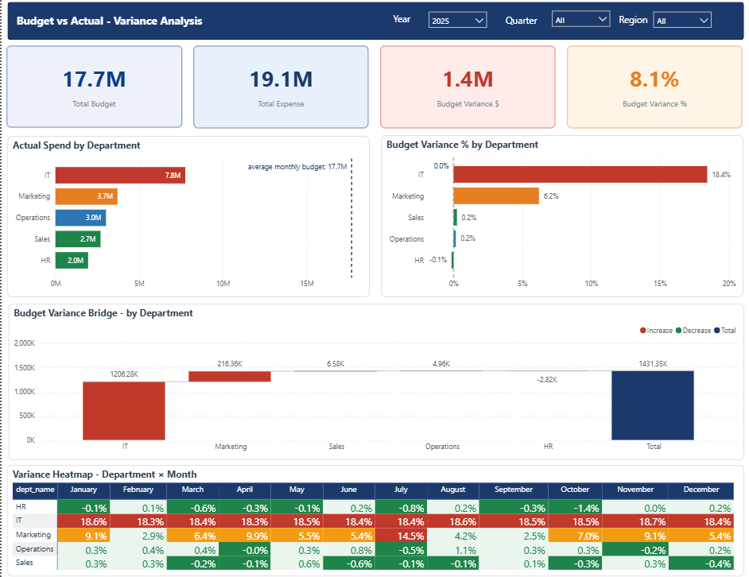
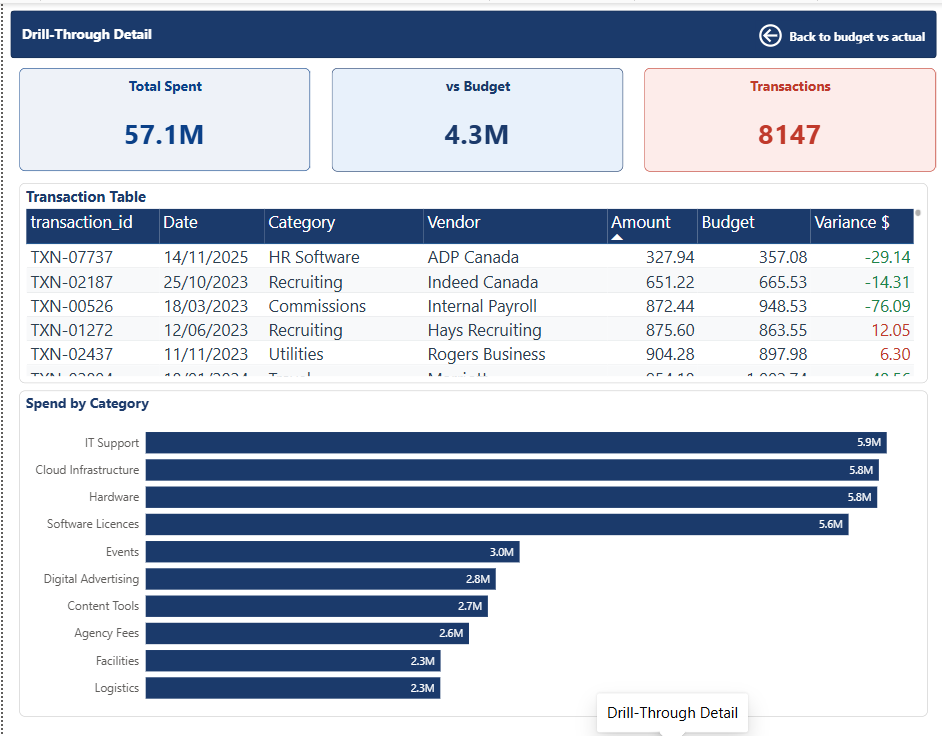

# 💰 CFO Financial KPI Dashboard


A production-grade financial analytics platform built for a fictional Canadian B2B company (NorthStar Analytics Inc.) 

## 🔗 Live

- **Streamlit Dashboard:** https://cfo-dashboard-2026.streamlit.app
- **Power BI Report:** Available in `/powerbi/CFO_Dashboard.pbix`

---

## 📸 Dashboard Screenshots

### Executive Summary


### Revenue & Expenses


### Budget vs Actual


### Drill-Through Detail


---
## 🏗️ Architecture

```
Excel/Synthetic Data
        │
        ▼
Apache Airflow ETL Pipeline
        │
        ▼
PostgreSQL Star Schema (local + Supabase cloud)
        │
        ├──────────────────────────────┐
        ▼                              ▼
Power BI Dashboard (CFO)    Streamlit Dashboard (Analyst)
4 pages, DAX measures       6 pages, live ML predictions
        │                              │
        └──────────────────────────────┘
                       │
                       ▼
            ML Models (Prophet + Isolation Forest + XGBoost + SHAP)
```
---

## ⚙️ Tech Stack

| Layer | Technology |
|---|---|
| Language | Python 3.11 |
| Database | PostgreSQL 15 (Docker) + Supabase (cloud) |
| Orchestration | Apache Airflow |
| ML | Prophet, Isolation Forest, XGBoost, SHAP |
| BI | Power BI (DAX, star schema, drill-through) |
| Dashboard | Streamlit + Plotly |
| Infrastructure | Docker, GitHub Actions CI/CD |
| Cloud | Supabase (Canada Central), Streamlit Cloud |

---

## 📊 What It Does

### Descriptive Analytics (Power BI + Streamlit)
- Executive summary with revenue, expense, profit KPIs
- Year-over-year expense comparison across 5 departments
- Budget vs actual variance analysis with heatmap
- Transaction-level drill-through with CSV export

### Predictive Analytics (ML Models)
- **Prophet :** 6-12 month revenue forecasting (MAPE 9.6%)
- **Isolation Forest :** expense anomaly detection (Precision 68%, Recall 78%)
- **XGBoost :** budget overrun risk classifier (AUC-ROC 0.94 CV)
- **SHAP :** per-department explainability waterfall charts

### Data Engineering
- Synthetic dataset: 8,147 transactions, 36 injected anomalies, Jan 2023 – Dec 2025
- Star schema: fact_financials + 4 dimension tables
- 19/19 data quality checks passing
- Airflow DAG: 7 tasks, daily schedule, idempotent loads

---

## 🗂️ Project Structure
```
cfo-dashboard/
├── data/raw/                   <- synthetic data generator
├── etl/
│   ├── extract/                <- source connectors, schema validation
│   ├── transform/              <- cleaning, KPI builder, star schema
│   └── load/                   <- PostgreSQL writer, data quality checks
├── dags/                       <- Airflow DAG
├── ml/
│   ├── forecasting/            <- Prophet revenue forecast
│   ├── anomaly/                <- Isolation Forest detection
│   ├── classification/         <- XGBoost overrun classifier
│   └── explainability/         <- SHAP waterfall charts
├── streamlit/
│   ├── app.py                  <- landing page
│   ├── pages/                  <- 6 dashboard pages
│   ├── utils/                  <- DB queries, formatters
│   └── assets/                 <- CSS styles
├── powerbi/                    <- CFO_Dashboard.pbix
├── tests/                      <- 18 unit tests
├── scripts/                    <- setup and deployment scripts
├── Dockerfile
└── .github/workflows/ci.yml    <- GitHub Actions
```
---

## 🚀 Run Locally

### Prerequisites
- Docker Desktop
- Python 3.11
- Power BI Desktop (for .pbix file)

### Setup

```bash
# Clone the repo
git clone https://github.com/Batool-Altarawneh/cfo-dashboard.git
cd cfo-dashboard

# Create virtual environment
python -m venv venv
source venv/Scripts/activate  # Windows Git Bash

# Install dependencies
pip install -r requirements.txt

# Start PostgreSQL and Airflow
docker compose up -d

# Generate synthetic data and run ETL
python data/raw/generate_data.py
python etl/extract/raw_loader.py
python etl/transform/star_schema_builder.py
python etl/load/data_quality.py

# Train ML models
python ml/forecasting/train_prophet.py
python ml/anomaly/train_isolation_forest.py
python ml/classification/train_xgboost.py

# Run Streamlit dashboard
streamlit run streamlit/app.py
```

### Run Tests

```bash
python -m pytest tests/ -v
```

---

## 🤖 ML Model Details

### Prophet Revenue Forecasting
- Additive seasonality: better for limited training data
- MAPE 9.6%, MAE $58K on 12-month holdout
- Q4 revenue spike correctly captured

### Isolation Forest Anomaly Detection
- 8 domain-informed features: no data leakage
- Precision 68%, Recall 78% without any labelled training data
- Catches 28 of 36 injected anomalies

### XGBoost Budget Overrun Classifier
- 6 mid-quarter features: all available before quarter ends
- AUC-ROC 0.94 on cross-validation
- scale_pos_weight handles class imbalance

---

## 🎯 Key Design Decisions

| Decision | Rationale |
|---|---|
| Synthetic data over Kaggle | Ground truth control for anomaly validation |
| Additive Prophet seasonality | Multiplicative caused zero predictions with limited data |
| No vendor names in Isolation Forest | Would constitute data leakage |
| SQLAlchemy 1.4 in Airflow | Airflow 2.9.1 requires SQLAlchemy < 2.0 |
| Supabase Canada Central | Data residency alignment with Canadian portfolio target |

---

## 👩‍💻 Author

**Batool Altarawneh**
Data Analyst | ML Engineer
[GitHub](https://github.com/Batool-Altarawneh) · [LinkedIn](https://linkedin.com/in/batooltarawneh)